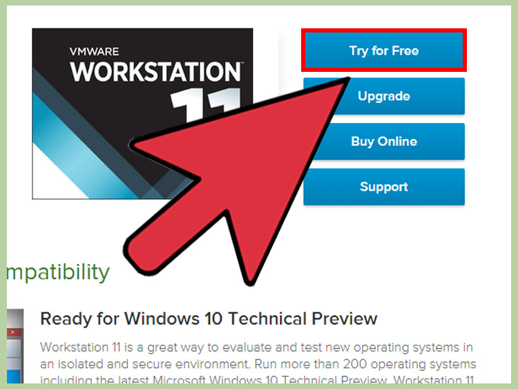

# VMWare 

VMware Workstation is a program that allows you to run a virtual computer within your physical computer. The virtual computer runs as if it was its own machine. A virtual machine is great for trying out new operating systems such as Linux, visiting websites you don't trust, creating a computing environment specifically for children, testing the effects of computer viruses, and much more. You can even print and plug in USB drives. Read this guide to get the most out of VMware Workstation.

# Installing VMware Workstation

**1. Make sure your computer meets the system requirements.** Because you will be running an operating system from within your own operating system, VMware Workstation has fairly high system requirements. If you don’t meet these, you may not be able to run VMware effectively.
You must have a 64-bit processor.
VMware supports Windows and Linux operating systems.
You must have enough memory to run your operating system, the virtual operating system, and any programs inside that operating system. 1 GB is the minimum, but 3 or more is recommended.
You must have a 16-bit or 32-bit display adapter. 3D effects will most likely not work well inside the virtual operating system, so gaming is not always efficient.
You need at least 1.5 GB of free space to install VMware Workstation, along with at least 1 GB per operating system that you install.

**2. Download the VMware software.** You can download the VMware installer from the Download Center on the VMware website. Select the newest version and click the link for the installer. You will need to login with your VMware username.
You will be asked to read and review the license agreement before you can download the file.
You can only have one version of VMware Workstation installed at a time.

**3. Install VMware Workstation.** Once you have downloaded the file, right-click on the file and select “Run as administrator”.
You will be asked to review the license again.
Most users can use the Typical installation option.
At the end of the installation, you will be prompted for your license key.
Once the installation is finished, restart the computer.
Part

# Installing an Operating System

**1. Open VMware.** Installing a virtual operating system is much like installing it on a regular PC. You will need to have the installation disc or ISO image as well as any necessary licenses for the operating system that you want to install.

* You can install most distributions of Linux as well as any version of Windows.

**2. Click File.** Select New Virtual Machine and then choose Typical. VMware will prompt you for the installation media. If it recognizes the operating system, it will enable Easy Installation:

* *Physical disc* – Insert the installation disc for the operating system you want to install and then select the drive in VMware.
* *ISO image* – Browse to the location of the ISO file on your computer.
* *Install operating system later*. This will create a blank virtual disk. You will need to manually install the operating system later.

**3. Enter in the details for the operating system.** For Windows and other licensed operating systems, you will need to enter your product key. You will also need to enter your preferred username and a password if you want one.
* If you are not using Easy Install, you will need to browse the list for the operating system you are installing.

**4. Name your virtual machine.** The name will help you identify it on your physical computer. It will also help distinguish between multiple virtual computers running different operating systems.

**5. Set the disk size.** You can allocate any amount of free space on your computer to the virtual machine to act as the installed operating system’s hard drive. Make sure to set enough to install any programs that you want to run in the virtual machine.

**6. Customize your virtual machine’s virtual hardware.** You can set the virtual machine to emulate specific hardware by clicking the “Customize Hardware” button. This can be useful if you are trying to run an older program that only supports certain hardware. Setting this is optional.

**7. Set the virtual machine to start.** Check the box labeled “Power on this virtual machine after creation” if you want the virtual machine to start up as soon as you finish making it. If you don’t check this box, you can select your virtual machine from the list in VMware and click the Power On button.

**8. Wait for your installation to complete.** Once you’ve powered on the virtual machine for the first time, the operating system will begin to install automatically. If you provided all of the correct information during the setup of the virtual machine, then you should not have to do anything.
If you didn’t enter your product key or create a username during the virtual machine setup, you will most likely be prompted during the installation of the operating system.

**9. Check that VMware Tools is installed.** Once the operating system is installed, the program VMware Tools should be automatically installed. Check that it appears on the desktop or in the program files for the newly installed operating system.

VMware tools are configuration options for your virtual machine, and keeps your virtual machine up to date with any software changes.

# Navigating VMware

**1. Start a virtual machine.** To start a virtual machine, click the VM menu and select the virtual machine that you want to turn on. You can choose to start the virtual machine normally, or boot directly to the virtual BIOS.

**2. Stop a virtual machine.** To stop a virtual machine, select it and then click the VM menu. Select the Power option.

* *Power Off* – The virtual machine turns off as if the power was cut out.
* *Shut Down Guest* – This sends a shutdown signal to the virtual machine which causes the virtual machine to shut down as if you had selected the shutdown option.
* You can also turn off the virtual machine by using the shutdown option in the virtual operating system.

**3. Move files between the virtual machine and your physical computer.** Moving files between your computer and the virtual machine is as simple as dragging and dropping. Files can be moved in both directions between the computer and the virtual machine, and can also be dragged from one virtual machine to another.

* When you drag and drop, the original will stay in the original location and a copy will be created in the new location.
* You can also move files by copying and pasting.
* Virtual machines can connect to shared folders as well.

**4. Add a printer to your virtual machine.** You can add any printer to your virtual machine without having to install any extra drivers, as long as it is already installed on your host computer.

* Select the virtual machine that you want to add the printer to.
* Click the VM menu and select Settings.
* Click the Hardware tab, and then click Add. This will start the Add Hardware wizard.
* Select Printer and then click Finish. Your virtual printer will be enabled the next time you turn the virtual machine on.

**5. Connect a USB drive to the virtual machine.** Virtual machines can interact with a USB drive the same way that your normal operating system does. The USB drive cannot be accessed on both the host computer and the virtual machine at the same time.

* If the virtual machine is the active window, the USB drive will be automatically connected to the virtual machine when it is plugged in.
* If the virtual machine is not the active window or is not running, select the virtual machine and click the VM menu. Select Removable Devices and then click Connect. The USB drive will automatically connect to your virtual machine.

**6. Take a snapshot of a virtual machine.** A snapshot is a saved state and will allow you to load the virtual machine to that precise moment as many times as you need.

* Select your virtual machine, click the VM menu, hover over Snapshot and select Take Snapshot.
* Give your Snapshot a name. You can also give it a description, though this is optional.
* Click OK to save the Snapshot.
* Load a saved Snapshot by clicking the VM menu and then selecting Snapshot. Choose the Snapshot you wish to load from the list and click Go To.

**7. Become familiar with keyboard shortcuts.** A combination of the "Ctrl" and other keys are used to navigate virtual machines. For example, "Ctrl," "Alt" and "Enter" puts the current virtual machine in full screen mode or moves through multiple machines. "Ctrl," "Alt" and "Tab" will move between virtual machines when the mouse is being used by 1 machine.